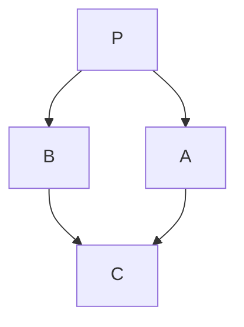

[TOC]

# C++

## class访问修饰符（Class Modifier）

1.  public				 自己的类可以访问，但派生类也能访问
2.  protected          自己的类可以访问，但派生类可以访问
3.  private（默认）自己的类可以访问，但派生类不能访问

|           | 类体内 | 类体外 | 友元函数 | 派生类 |
| :-------: | :----: | :----: | :------: | :----: |
|  public   |  可见  |  可见  |   可见   |  可见  |
| protected |  可见  | 不可见 |   可见   |  可见  |
|  private  |  可见  | 不可见 |   可见   | 不可见 |

类体内指的是在一个class括号中

类体外指的是在class括号外的

友元函数指的是不是类成员却能够访问类的所有成员的函数

派生类指的是利用继承机制产生的新的类

```cpp
#include <iostream>
#include <string>
class Player {
public:
    string name;
    int level;
    float health;
    void attack() {
        cout << name << " cause damage.\n"
    }
}

int main() {
    Player p1 = {"lorem", 1, 100.f}
    p1.attack();
}
```

将属性命名为protected，使得派生类的方法中也可以直接访问到原属性。

## 构造函数（Constructor Function）

构造器函数用于在创建新对象时设置默认值

构造器函数特点

1.  没有返回类型
2.  和类名同名

```cpp
class Player {
public:
    string name;
    int level;
    float health;
    // 类的内部，生成的构造函数
    Player(string name, int level, float health) {
        name = "default name";
        level = 1;
        health = 100.f;
    };
}
// 在类的外部生成的构造函数
Player::Player() {
    
}
```

## 复制构造函数

浅复制

加`const`防止引用时被修改

```cpp
class A {
public:
    A()
    ~A()
    // 复制构造函数
    A(A &a)
private:
}

int main() {
    A b(a); // A b = a;
    return 0;
}
```

1.  复制对象
2.  函数返回值为对象
3.  形参为类的对象

## 编译器默认提供函数

```cpp
class Empty {
public:
    Empty(){}
    Empty(const Empty& rhs){...}
    ~Empty(){}
    Empty operator = (const Empty& rhs){...}
}
```

## 友元函数（Friendly Function）

友元函数的作用就是方便我们使用到类中的私有成员

```cpp
class People{
private:
    int age;
    string gender;
public:
    friend void show(){
        cout << age << gender << endl;
    }
}
```


## 封装（Encapsulation）

防止外部的访问直接修改类中的数据

通过对类中设置方法（setter&getter）来使得间接获得数据

```cpp
class Player {
private:
    string name;
    int level;
    float health;
public:
    // start of encapsulation
    void setName(string name) {
        name = name;
    }
    string getName() {
        return name;
    }
    void setLevel(int level) {
        level = level;
    }
    int getLevel() {
        return level;
    }
    void setHealth(float health) {
        health = health;
    }
    float getHealth() {
        return health;
    }
    // end of encapsulation
    void attack() {
      cout << "attack" << endl;  
    };
    Player(string name, int level, float health) {
        name = "default name";
        level = 1;
        health = 100.f;
    };
}
```

## 抽象&接口（Abstract & Interface）

将背后复杂的流程隐藏，只显示简单的表面

```cpp
class AbstractPlayer {
    virtual void getAdvanceState() = 0;
};
class Player:AbstractPlayer { // inherit from the class named AbstractPlayer
public:
    string name;
    int level;
    float health;
    Player(string name, int level, float health) {
        name = "default name";
        level = 1;
        health = 100.f;
    };
    getAdvanceState() {
        // complex code to realize this method
        if (level > 10) {
            cout << "Got advanced!\n"
        } else {
            cout << "Sorry.\n"
        }
    }
};
```

## 继承（Inheritance）

派生类继承自基类

基类相对宽泛，派生类则更加具体

```cpp
class Player {
public:
    string name;
    int level;
    float health;
    Player(string name, int level, float health) {
        name = "default name";
        level = 1;
        health = 100.f; // 注意构造器函数中的类属性不能与传入变量同名
    };
}
class Admin: public Player {
public:
    string adminLevel;
    // constructor function
    Admin(string name, int level, float health, string adminLevel) 
    	:Player(name, level, health) // using :[ClassName](paras) to transfer
    {
    	adminLevel = AdminLevel;        
    }
    // another version
    Admin(string Name, int Level, float Health, string adminLevel):
    	name(Name),level(Level),health(Health)
    {
        // code here...
    }
}
```

通过修改继承前的修饰符，可以改变派生类对基类属性的调用和访问。

修饰符包括public，private，protected三种

1.  public

    完全不变，基类的所有的成员前的修饰符全部保留

2.  private

    完全私有，基类的所有成员均会变成私有

3.  protected

    基类中的public和protected会全部变成protected，private则不会变化

## 动态内存管理（Stack & Heap）

```c++
int* p = new int; // 1.此时在stack中会push进一个p
*p = 3;  // 2.此时在heap中会划分一块内存，填入3，并将stack中的p指向heap中的地址
{ delete p }
p = new int(15);  // 3.此时heap中会划分一块另一块内存，填入15，并将stack中的p指向heap中的地址
// 4.这就浪费了原本存放3的内存，由于地址用户无法得知，造成内存泄露
// 5.所以在第三行我们清空了p指向的内存，也就是原本保存3的内存地址
// 6.删除后由于p指向的内容为空，造成悬空指针，此时需要使用nullptr来处理(或者0)
p = nullptr;
p = 0;
```

## 析构函数（Destructor Function）

析构函数和构造函数相反，析构函数用于某个对象的生命周期结束时，对其产生的内存等的清理。

 ```c++
 class Player {
 public:
     string name;
     int level;
     float health;
     // 构造函数
     Player(string name, int level, float health) {
         name = "default name";
         level = 1;
         health = 100.f;
     };
     // 析构函数
     ~Player() {
         cout << "the object is dead." << endl;
     }
 }
 
 Player::~Player() {
         cout << "the object is dead." << endl;
 }
 ```

## 静态变量（Static）

使用static修饰符修饰的变量或对象，会无视作用域的限制。

1.  静态变量

    ```C++
    static p = 1;
    ```

2.  静态类

    ```c++
    class Dog {}
    
    int main() {
        if (true) {
            static Dog dog;
        }
    }
    ```

3.  静态类中的数据成员

    由于static修饰的成员无视作用域，因此它必须在类外初始化

    调用时同样可以直接使用，而不需要再一次进行对象的生成

    ```c++
    class Player {
        static int age;
        string name = "Chen";
    }
    // 初始化格式
    int Player::age = 18;
    
    int main() {
        Player::age = 19;
        cout << Player::age << endl; // 19
    }
    ```

4.  静态成员函数

    函数调用不需要新增对象，直接使用``类名::函数名``即可调用

    ```C++
    class Player {
        static void greeting() {
            cout << "Hello" << endl;
        }
    }
    
    Player::greeting()
    // Hello
    ```


## 虚函数（Virtual Function）

虚函数用于实现在继承中基类和派生类同名函数的不同用途

同名的greeting函数在不同的类生成的对象调用时返回的结果也不同。

```c++
class Parent {
public:
    virtual void greeting() {
        cout << "hello" << endl;
    }
}

class Child : public Parent {
public:
    void greeting() {
        cout << "what's up" << endl;
    }
}

class GrandChild() {
public:
    virtual void greeting() override {  
    // void前的 virtual 可加可不加 override 说明了此函数是基类函数重写后得到的
        cout << "Aoooo" << endl;
    }
}
```

## 多态（Polymorphism）

在不同类的同名方法，由最近的类来决定对应的输出。

通常将基类的某个方法定义为虚函数，这样在派生类调用时，会根据具体不同的类中的同名方法进行覆盖，来达成多态的效果。

```cpp
class Base {
public:
    Base();
   	virtual void func() {
        // code here...
        cout << "this is a function call from the Base class.\n"
    }
}

class A: public Base {
public:
    A();
    void func() {
        cout << "this is a function call from the A class.\n" 
    }
}

int main() {
    A a1 = A();
    Base* e1 = &a1;
    // with virtual keyword
    e1->func(); // this is a function call from the A class.
    // without virtual keyword
    e1->func(); // this is a function call from the Base class.
}
```

多继承问题（菱形继承问题）



P作为基类存在函数f()

A，B作为P的派生类自然也有函数f()

C多继承自A和B，此时的C中有两个函数f()

使用时需要注意区分

```c++
class P {}
class A : public P {}
class B : public P {}
class C : public A, public B {}

// 生成对象
C c;
// 调用
c.A::f();
c.B::f();
```

或者使用虚继承

```c++
class P {}
class A : virtual public P {}
class B : virtual public P {}
class C : public A, public B {}

// 生成对象
C c;
// 调用
c.f();
```

## 数据格式转换（Casting）

**隐式转换**

```c++
float f = 5.0;
int i = f; // 5
```

**显式转换**

```c++
float f = 3.52;
int i = (int)(f);
```

**动态类型转换**

动态检查类型，使用于多态类型

使用``dynamic_cast <newType> (expression)``

```c++
P* p;
A* a;
B* b;
C* c = new C;
// 将c类型的指针转换成p类型的指针
// upcast 子类转成父类
p = dynamic_cast<P*>(c);
// or
p = c;

// downcast 父类转成子类 
a = dynamic_cast<A*>(p);
// crosscast
b = dynamic_cast<A*>(b);
```

**静态类型转换**

强制转换类型，不局限于多态类型

``static_cast``

**常量类型转换**

转换数据的常量性

``const_cast``

## 头文件（Header Files）

.h文件声明了变量函数等资产

.cpp文件进行功能的实现

.cpp包含在.h中

主文件中通过使用

``#include <xxx.h>``

来获得对应的.h文件以及对应的.cpp文件

## 模板（Template）

1.  函数模板
2.  类模板

模板不可直接引用

```cpp
template <typename T>
T Add(const T& a, const T& b){
    return a + b; 
}

// call 
int res = Add<int>(a,b)
```

类模板

```cpp
template <class T>
class className {
    private:
    	T a;
    	...
    public:
    	T func1(T args);
    	...
}
```

